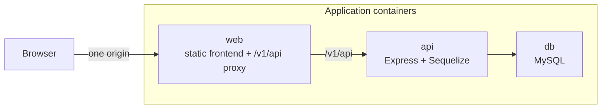
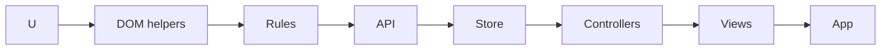
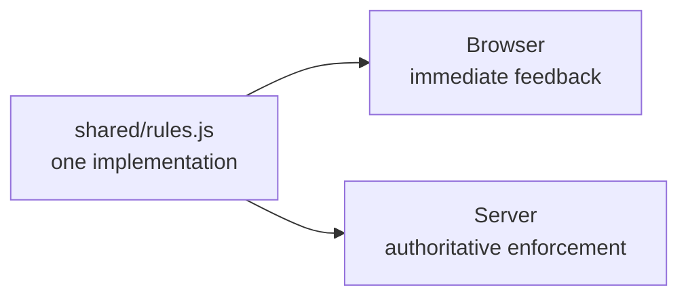
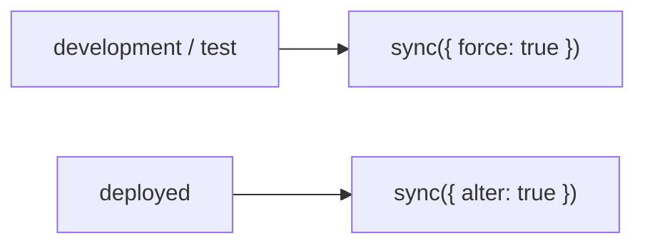
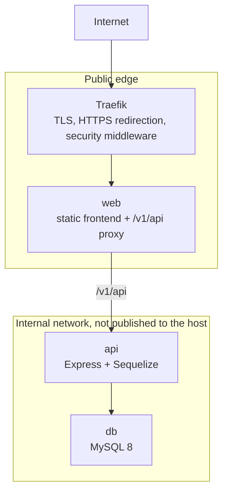
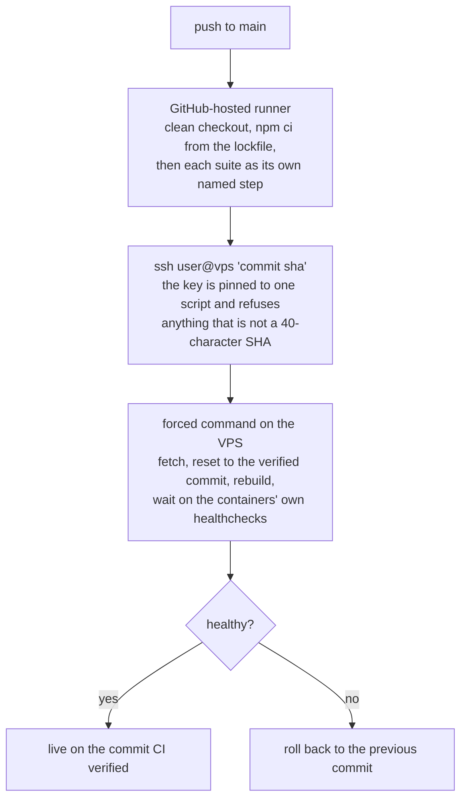
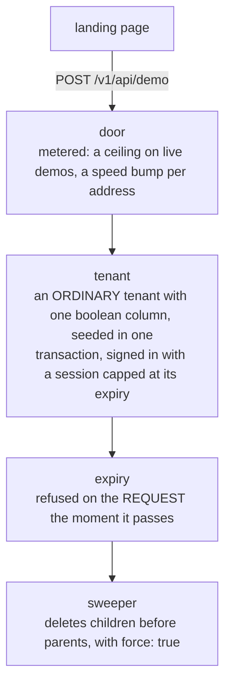

# Multi-Tenant Full-Stack CRUD Skill


A **multi-tenant full-stack CRUD Agent Skill** for Claude Code that teaches an opinionated, production-oriented architecture for building **role-scoped, audited business web apps** with **Express, Sequelize, MySQL, vanilla JavaScript, Docker and Traefik**.

Use it to start a full-stack CRUD application or extend an existing one with models, controllers, routes, views, authorization rules, audit trails, tests and deployment configuration.

The architecture deliberately trades framework features for a surface small enough that one person can hold all of it: **no frontend framework, no build step, no migrations, no hand-written CRUD and no action routes**.

A generic `crudThat` factory serves almost every resource. What an operation *means* belongs in the model's controller hooks rather than in additional endpoints. Authorization is enforced through tenant and role scopes rather than UI state, and the browser and server run the same domain-rules module so each rule has one implementation with enforcement on both sides of the API boundary.

The repository includes `samples/`, a runnable reference implementation of the complete stack: frontend, backend, shared rules, authentication, role-based access, auditing, MySQL deployment and three levels of automated testing.

Its annotated files document not just what the architecture does, but why particular decisions exist. Many of those decisions came from bugs that were paid for once already.

## What this skill teaches Claude to do differently

* **Adds a hook, not a route.** `POST /tasks/:id/cancel` creates a second authorization surface and it is the one that gets forgotten, so cancelling is a `PUT` told apart by what the body carries.

* **Puts access control in `extraFilters`.** It is a `where` the client cannot influence, applied to every read, update, delete and create, and proved in tests over real HTTP for every role. Hiding a button is a courtesy.

* **Refuses unreadable records by returning nothing, not `403`.** A record you may not read has to look exactly like a record that does not exist, or the endpoint becomes an oracle for whether one exists.

* **Coerces types at the API boundary.** Browsers send every id as text, hooks reason about the body *before* the write, and `7 === "7"` is false. A string that reaches domain logic can quietly walk past an invariant.

* **Declares the index before the sort.** Every `defaultSortingColumn` must be a contiguous run at either end of an appropriate index, and a generic test enforces it. A filesort is invisible on seeded data and expensive on real data.

* **Drives forms in a real browser.** Every form and upload earns a step in the end-to-end suite because a route declared `PUT` on the server and sent as `POST` by the browser can answer `404` for every upload while both unit suites still pass.

* **Treats an environment variable as one atomic change.** Mapping, default, `.env.example` and the relevant Compose block move together because every partial state can fail silently.

* **Keeps domain rules shared but authority server-side.** The browser runs the same rules for immediate feedback, while the server applies them again and remains authoritative.

* **Treats the audit trail as protected data.** If a role cannot read a model, it must not be able to reconstruct that model through its audit entries.

* **Ships behavior with a regression test.** New behavior gets a test that fails before the change and passes afterward; a bug fix first reproduces the bug.

* **Offers automatic deployment at the moment it becomes relevant, and asks first.** A first deployment, a question about making the app publicly accessible, or an MVP about to be used is when push-to-main CI is worth raising — as a question, together with whether the VPS hosts anything else, because that answer decides every name placed on that box.

* **Offers a landing page at the same moment, built from what the product does today.** A feature list written from the roadmap is a support ticket per line. The page is a separate document that loads none of the application, because a marketing page that boots the app answers 401 to every visitor before it paints.

* **Offers a demo anybody can try without signing up — and deletes it.** One button provisions a whole tenant, seeded and signed in, gone a day later. It is an ordinary tenant rather than a mode, its expiry is enforced on the request rather than by a timer, and it is deleted with `force: true`, because these models are `paranoid` and a soft delete would make "deleted after a day" false in the only way that matters.

## Architecture

The stack is intentionally small:

```text
frontend/     browser UI: index.html (public landing page), app.html (the
              app), css/, js/, js/views/
shared/       rules.js and utils.js, used by browser and server
backend/      Express + Sequelize API
tools/        static server, API proxy, browser smoke tests, checks
tests/        frontend unit tests
docs/         user documentation and screenshots
```

Production runs as three application containers:



Traefik sits at the edge for TLS and routing.

The browser talks only to the `web` origin. `/v1/api` is proxied internally to the API, avoiding a separate browser-facing API origin and the CORS and cookie complexity that comes with it.

## The CRUD model

Almost every resource is served through one generic factory:

```js
guarded.use('/customers', crudThat(db.Customer, controllers.customer));
```

The CRUD surface stays deliberately small:

```text
POST   /
GET    /
GET    /:id
PUT    /:id
DELETE /:id
```

Do not hand-write ordinary CRUD endpoints and do not add action routes for domain operations that can be represented as resource state changes.

Booking, moving, cancelling, completing and reassigning are distinguished by the body and implemented through controller hooks.

Hand-written routes are reserved for actual transitions outside normal resource CRUD, such as authentication, tenant provisioning or data import/export.

## Controller hooks

Each resource gets a controller that describes the behavior around generic CRUD.

| Hook                                   | Purpose                                                   |
| -------------------------------------- | --------------------------------------------------------- |
| `extraFilters(req, res)`               | Authorization and tenant/role scope                       |
| `createDefaultAssociations(req, res)`  | Ownership, defaults, sanitization and create-time refusal |
| `beforeUpdate(req, res, body, filter)` | Validate proposed state before writing                    |
| `afterUpdate` / `afterDelete`          | Awaited follow-up work                                    |
| `onCreated(req, res, row)`             | Dependent records and audit entries                       |
| `beforeSend(req, res, result)`         | Derived figures needed by the response                    |
| `hiddenFields(req, res)`               | Fields the current role may not read                      |
| `readOnlyFields(req, res)`             | Fields that may not be externally updated                 |
| `allowedIncludes(req, res)`            | Associations the current role may eager-load              |
| `searchableFields(req, res)`           | Fields included in generic search                         |
| `deleteFilters(req, res)`              | Delete-specific scope                                     |
| `onCreateError` … `onDeleteError`      | Resource-specific error responses                         |

The repository includes both a controller template documenting every hook and worked examples showing how the hooks compose.

## Access model

Authorization is split deliberately across three concerns.

### Capabilities

`services/capabilities.js` declares what each role may *do*.

The same capability table is sent to the frontend so the browser does not maintain a second authorization vocabulary.

UI permissions improve the experience. They are not the security boundary.

### Scope

`services/scope.js` pins every query to its tenant and, where necessary, a narrower scope inside that tenant.

A deny scope matches nothing.

### Controller enforcement

Each controller's `extraFilters` adds the resource-specific authorization boundary as query conditions the client cannot influence.

Access rules stay explicit and local to the controller rather than disappearing into generic authorization helpers.

## Multi-tenancy

Tenant-scoped resources carry an organization reference and every relevant query is constrained by the authenticated tenant.

The sample application also demonstrates a second scope inside the tenant, allowing patterns such as:

* owners seeing the whole organization,
* staff seeing only their workspace,
* portal users seeing only their own records,
* roles being refused an entire model.

The same restrictions apply to related audit data.

## Audit trail

Updates are audited before the write so both the previous and proposed values are available.

Audit rows are created only for fields that actually changed.

Field names come from a shared vocabulary rather than free-form labels so filtering, seed data, tests and presentation remain aligned.

The audit trail is treated as a second copy of sensitive application data and receives the same access controls as the records it describes.

## Query API

Generic list endpoints support:

```text
?column=value
?by_<column>_<op>=value
?in_<column>=1,2,3
?sort_by=column
?sort_direction=ASC|DESC
?offset=
?limit=
?with_count=true
?count_only=true
?search=term
?include=Alias
?show_deleted=true
```

Supported comparison operators include:

```text
eq
ne
gt
lt
lte
gte
like
in
```

Hidden fields cannot be searched, filtered or sorted.

That prevents a caller from learning a protected value indirectly through yes/no query results.

## Types at the API boundary

Query-string values and request bodies are coerced against Sequelize model types before controller hooks reason about them.

This matters because browsers naturally send ids through URLs, form values, `<select>` elements and dataset attributes as strings.

The backend receives a typed domain representation rather than requiring every individual controller to normalize inputs itself.

## Frontend

The frontend uses **vanilla JavaScript with no framework and no build step**.

Scripts are loaded directly by the browser:



A view follows a simple lifecycle:

```js
load(params)
render(params, data)
mount(root, data)
```

`load` fetches exactly what the screen needs.

`render` is synchronous and returns HTML.

`mount` performs DOM behavior after rendering.

Views do not call the API directly. `Store` owns communication with the server and keeps server access in one layer.

## Shared domain rules

`shared/` is DOM-free and runs in both Node.js and the browser.

A domain rule therefore has one implementation:



Client-side validation is never the only enforcement point.

Browser-specific helpers live separately from the shared module.

## Tests

Three layers cover the stack.

### Frontend unit tests

```bash
npm test
```

Rules, helpers and view logic are exercised without a browser where possible.

### API tests

```bash
cd backend && npm test
```

Authorization is tested over real HTTP for every role.

Framework-level CRUD behavior is tested independently against isolated models.

### Browser smoke tests

```bash
npm run smoke
```

Puppeteer drives the running application end to end.

Forms, uploads and multi-step interactions are tested by actually using them rather than by testing only the functions that are supposed to issue their requests. That includes the landing page's demo button, which is the one control in the product pressed first by people who have never signed in.

The browser suite also fails on:

* console errors,
* uncaught exceptions,
* unexpected failed requests,
* rendering of values such as `undefined`, `NaN` or `[object Object]`.

Run everything with:

```bash
npm run verify
```

## Database and schema

Production uses **MySQL 8**.

SQLite is used for isolated automated tests.

There are intentionally no migrations. Sequelize applies the schema at startup using `sync()`:



This is a deliberate architectural trade-off, not an omission.

The skill also documents the important edge cases this approach leaves behind, including nullability changes that `sync({ alter })` does not correctly relax on existing tables.

Models declare the indices required by the queries they actually serve.

A generic test checks that default sorting is backed by appropriate indices so performance assumptions do not depend on development-sized datasets.

## Configuration

Application configuration lives under:

```text
backend/config/
```

Deployment-specific values and secrets enter through environment variables mapped into the configuration layer.

Adding, renaming or removing an environment variable is treated as one atomic change across:

```text
config/custom-environment-variables.json
config/default.json or environment-specific configuration
.env.example
docker-compose environment block
```

The repository includes checks that fail when those surfaces drift apart.

## Deployment

Both application images build from the repository root because `shared/` is consumed by both sides of the application.

```bash
docker build -f backend/Dockerfile .
docker build -f frontend/Dockerfile .

docker compose up -d --build
```

The production topology is:



The database is kept on an internal network and is not published to the host.

The API image:

* uses Node 22,
* installs production dependencies only,
* runs as a non-root user,
* writes nothing to disk,
* exposes a health check,
* waits for database initialization before listening,
* handles `SIGTERM` gracefully.

Traefik provides TLS, HTTPS redirection and reusable security-related HTTP middleware.

## Going live

The skill treats shipping as a decision rather than a default.

When the user reaches a first deployment, asks how to deploy or how to make the application publicly accessible, or arrives at an MVP somebody is about to use, three things become relevant at once — and the agent **offers all three as questions** rather than building any of them unasked:

| Offer | The question it turns on |
| --- | --- |
| Push-to-main deployment | Does the VPS host only this application, or other services too? That answer decides every name placed on that box. |
| A public landing page | Should `/` be a public page at all, and what does the product do *today*? |
| A no-sign-up demo | Do you want an unauthenticated stranger writing to your production database? |

In that order, because each leans on the one before: a landing page that points at nothing is worse than none, and the demo is the button on the landing page. "Just the deploy" is a complete answer — a product with one real user and no landing page is a normal product.

### Continuous deployment

The included implementation is deliberately small:



The key GitHub holds is pinned to that one script and refuses any argument that is not a 40-character commit SHA, so a stolen CI key can deploy a commit that is already in the repository and do nothing else.

The commit deployed is the one CI verified rather than `origin/main`, which is no longer the same thing once a second merge lands during a build.

`samples/ops/test-deploy.sh` drives the deploy script through a good deploy, refused commands, an unhealthy container, a build failure, a start-up timeout and a lock contest, using a real git repository and a stubbed Docker, so the rollback path is proven before the day it is needed.

`samples/ops/README.md` is the operator runbook for the steps only someone with shell on the VPS can perform.

### The landing page

`/` serves a public page and the application moves to `/app.html`.

It is a **separate document** rather than a route inside the app, and that is the whole design. The app boots by asking `/auth/me` who you are; a marketing page that did that would answer 401 to every visitor, log two console errors and paint its hero after a round trip. So the landing page loads none of the application's scripts — and the frontend suite evaluates its one script in an *empty* JavaScript context to keep it that way.

It shares the application's design tokens and nothing else, so a rebrand cannot leave the marketing page describing a product that no longer looks like that.

Three things the skill insists on:

* **The feature list is written from the code**, read back, and cut by the user. A feature list written from the roadmap is a support ticket per line.
* **`/` is what the healthcheck fetches.** Moving the front door means moving the mapping, the healthcheck's expectation and the browser suite in one change; a test asserts that whatever `/` resolves to is a file that actually exists, because this has already cost one deployment.
* **The application carries `noindex`**, the landing page does not, and `robots.txt` needs a MIME entry or it is served as a download.

### The demo tenant

One unauthenticated POST provisions a whole tenant — staff, sites, customers, a week of work either side of today, private notes and an audit trail — signs the visitor in as its owner, and deletes every row of it a day later.



The rules the implementation is built on:

* **It is an ordinary tenant, not a mode.** Same tables, same scope filters, same controllers. Nothing anywhere says `if (demo)`, so the tenant boundary that keeps two customers apart is what keeps a demo away from real data — and that boundary is already tested per role over real HTTP.
* **Expiry is enforced on the request, not by the timer.** The sweeper is about storage. If it were the only thing between an expired demo and its data, a crashed timer would silently extend every demo for ever.
* **`force: true`, or it is not deleted.** The models are `paranoid`; an ordinary destroy writes a `deletedAt` and keeps the row. The suite asserts the counts with `paranoid: false`, which is the only read that can tell the difference.
* **No password, so there is no second way in.** Demo accounts are created without one, and the login endpoint cannot succeed for an account with no stored hash however it is asked.
* **The seed runs in production**, so it may not require a devDependency, and every write takes the caller's transaction.
* **Off by default, and 404 when off** — a 403 would confirm to an unauthenticated caller that the endpoint is there.

Because the product's claim is that what you can see depends on who you are, the demo seeds the whole cast and puts a switcher in its banner: the same tenant, seen as the owner, the front desk, a member and a portal customer.

## Install

### Quick install

```bash
npx skills add DevN-gr/multi-tenant-fullstack-crud-skill
```

That installs the skill into `.claude/skills/` for the current project. Add `-g` to install into `~/.claude/skills/` and make it available everywhere.

The [`skills` CLI](https://github.com/vercel-labs/skills) supports Claude Code, Codex, Cursor, OpenCode and seventy other agents, so a specific target can be named:

```bash
npx skills add DevN-gr/multi-tenant-fullstack-crud-skill -g -a claude-code -y
```

Later, pull changes with:

```bash
npx skills update crud-stack
```

### Git clone: every project

```bash
git clone https://github.com/DevN-gr/multi-tenant-fullstack-crud-skill.git ~/.claude/skills/crud-stack
```

### Git clone: one project

```bash
git clone https://github.com/DevN-gr/multi-tenant-fullstack-crud-skill.git .claude/skills/crud-stack
```

Or keep it updateable inside an existing repository:

```bash
git submodule add https://github.com/DevN-gr/multi-tenant-fullstack-crud-skill.git .claude/skills/crud-stack
```

The repository is named for what it is.

The skill inside it is named `crud-stack`, which is why it installs into that directory.

Start a new Claude Code session and the skill can be loaded when a task matches its description, or invoke it directly with:

```text
/crud-stack
```

### Claude.ai and API

Package the skill:

```bash
zip -r crud-stack.zip SKILL.md samples/
```

and upload the resulting archive where Agent Skills are supported.

## What is included

```text
SKILL.md
  The Agent Skill itself:
  architecture, CRUD hooks, access model,
  tests, configuration, deployment,
  the landing page and the demo tenant.

samples/
  Runnable reference implementation.

  backend/
    Express + Sequelize
    generic crudThat factory
    controller hooks
    authentication
    CSRF
    tenant scope
    role capabilities
    audit trail
    demo tenant: door, seed and sweeper

  frontend/
    vanilla ES5 JavaScript
    no framework
    no build step
    load/render/mount views
    public landing page (index.html)

  shared/
    rules.js
    utils.js
    browser + server shared logic

  tools/
    static server
    API proxy
    Puppeteer end-to-end tests
    environment checks

  tests/
    frontend unit suite

  ops/
    VPS deploy script
    its test harness
    operator runbook

  .github/workflows/
    push-to-main pipeline
```

The sample domain includes resources such as:

```text
Organization
Workspace
Customer
Task
Note
```

These are placeholders selected because together they exercise the architectural rules the skill teaches:

* tenant isolation,
* a second scope inside a tenant,
* per-role capabilities,
* complete model denial,
* portal access scoped to one user's records,
* shared domain rules,
* auditing,
* authorization-aware queries.

`samples/README.md` explains which files can be reused directly and which are intended to be rewritten for your own domain.

## Using the skill

Ask for the work rather than describing the skill itself.

For example:

> Start a new app on this architecture: a lettings agency with landlords, properties, tenancies and inspections.

> Add an `Invoice` model scoped to the tenant that the owner and accounts team can read and write, but staff cannot see at all.

> Add an audited customer status field that only managers can change.

> Add a searchable resource and make sure its default sorting is indexed.

> Why is this list sorting slowly for the biggest tenant?

> This is ready for its first real users — how do I put it on a domain?

> Put a landing page on it that describes what it actually does.

> Let people try it without signing up, on data that cleans itself up.

For a new application, the skill helps lay out the repository, reuse the framework pieces and implement the first domain-specific resources against your access model.

For an existing application built on this architecture, it follows the model, controller, view, configuration and testing conventions already established.

Changes are expected to end with a test that fails before the implementation and passes afterward.

## Language and localisation

For non-English products:

| Surface            | Language         |
| ------------------ | ---------------- |
| Visible UI strings | Product language |
| User-facing email  | Product language |
| Code               | English          |
| Identifiers        | English          |
| Comments           | English          |
| API error codes    | English          |
| JSON keys          | English          |
| Tests              | English          |
| Documentation      | English          |

The API returns stable machine-oriented error codes.

The frontend maps those codes to localized presentation text.

This keeps presentation vocabulary out of the server API and allows the interface to be localized independently.

## Definition of done

A change is not complete until the relevant checks pass.

* [ ] `npm test` passes.
* [ ] `cd backend && npm test` passes.
* [ ] `npm run smoke` passes with a clean browser console.
* [ ] New behavior has regression coverage.
* [ ] Forms and uploads have been driven in a real browser.
* [ ] `npm run check` passes.
* [ ] Configuration changes are reflected everywhere they are declared.
* [ ] `README.md` reflects architectural changes.
* [ ] A new user-facing feature is reflected on the landing page, which still names nothing the product does not do.
* [ ] A new model or column is seeded into the demo tenant and deleted by the sweeper.
* [ ] User-visible strings follow the product language.
* [ ] Code, comments and tests remain in English.
* [ ] The interface has been checked at mobile and desktop widths.
* [ ] Both supported themes have been checked where applicable.

## Assumptions

The reference architecture assumes:

* Node.js 20+
* Express 4
* Sequelize 6
* MySQL 8 in production
* SQLite for isolated tests
* Docker Compose
* Traefik at the edge
* vanilla ES5 JavaScript in the browser
* no frontend build step

## Scope and limits

### A skill, not a scaffold

There is nothing to `npx`.

`samples/` is a reference implementation intended to be read, copied and adapted rather than treated as a generated application template.

### Opinionated by design

This architecture deliberately chooses a narrow set of technologies and conventions.

If your application is based on React, Next.js, Prisma, TypeScript or a substantially different backend architecture, most of the implementation-specific guidance will not transfer directly.

### No migrations

Schema changes use Sequelize `sync()` by design.

That keeps the system small but introduces real trade-offs. The skill documents those trade-offs rather than pretending they do not exist.

### Not a security product

The architecture provides a concrete access-control model and testing discipline for verifying it.

It is not a substitute for a security review, threat model or application security audit.

### Not a universal full-stack architecture

The goal is not to demonstrate every modern web-development technique.

The goal is to provide one coherent architecture whose complete surface can be understood, tested and maintained by a small team.

## Provenance

This architecture was extracted from a production multi-tenant practice-management application, generalized and stripped of its original domain.

The rules that appear unusually specific are often the ones learned from bugs that reached a running deployment.

## Contributing

Issues and pull requests are welcome.

Changes to the architecture should generally update both:

```text
SKILL.md
samples/
```

The skill's credibility depends on the reference implementation continuing to embody the rules the skill describes.

Changes should include appropriate tests and preserve the ability to run the sample application end to end.

## License

MIT. See [LICENSE](LICENSE).
